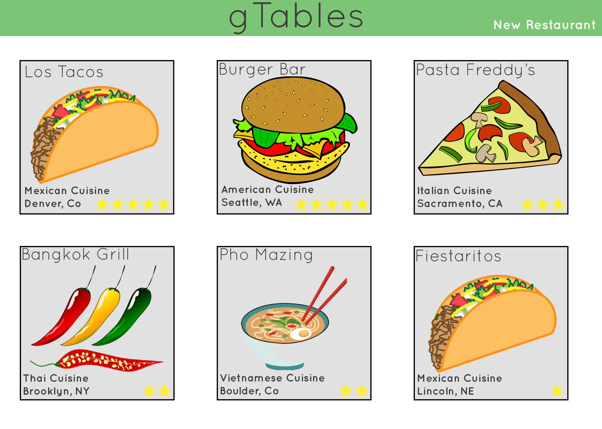
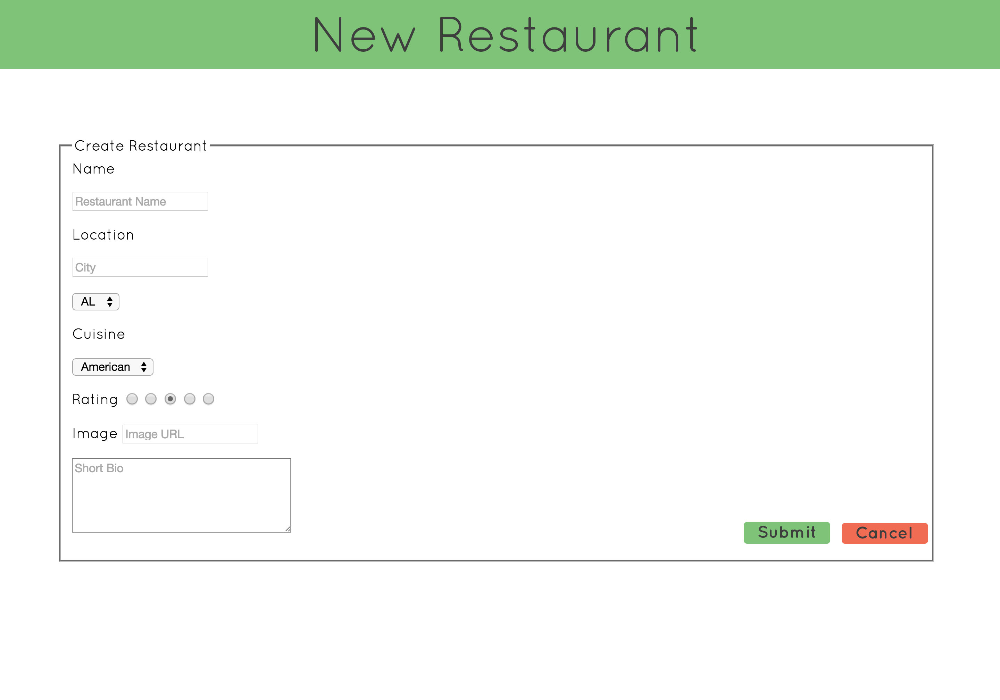
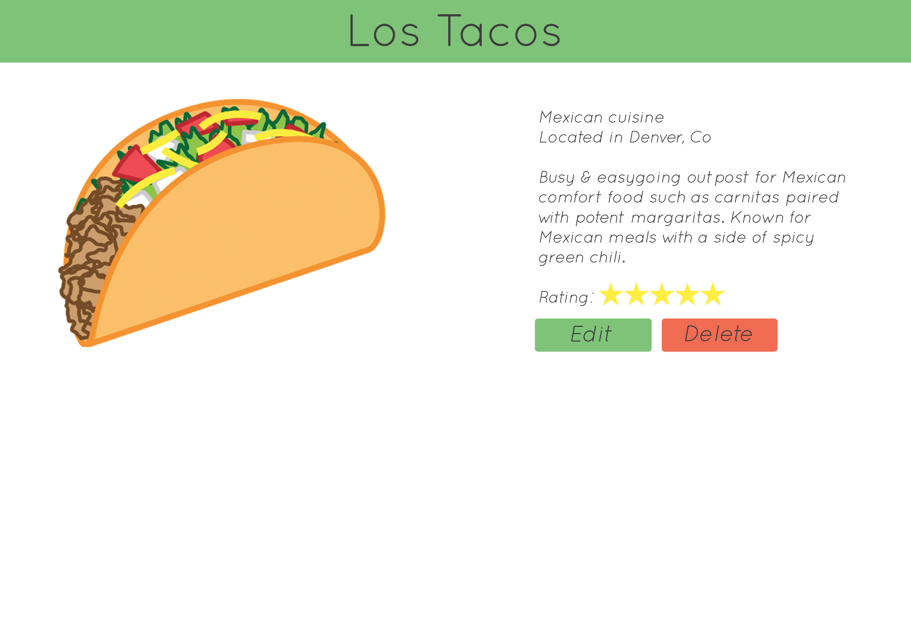
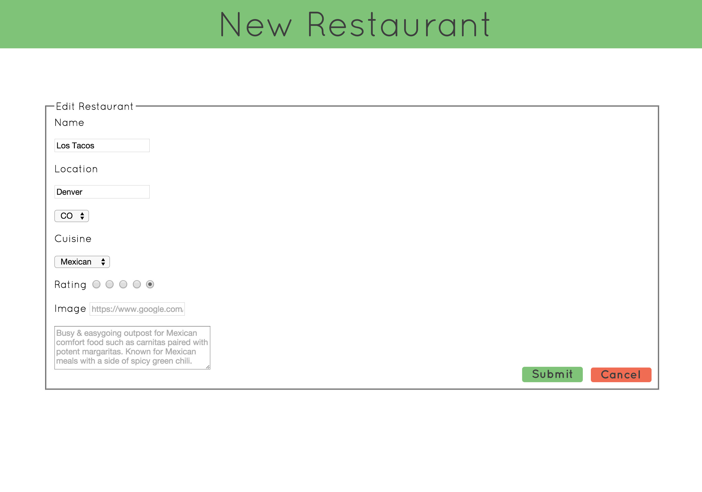

# Week One - Restaurants
Read through this entire document and create a web sequence diagram of your web app routes on https://www.websequencediagrams.com/#

___Drop your web sequence diagram here___

You will be using your skills in:
  * Express
  * RESTful CRUD routes
  * Database
  * Deployment*

#### Index
```
-When the user gets to the index page (localhost:3000/restaurants) they see all the restaurants in my database
-There should be 3 columns of restaurants
-There should only be 3 restaurants per column
-The title and image of the restaurant should be clickable
-Each restaurant has a Name, Image, Cuisine, Location, and Rating
-The user has the option to add a New Restaurant in the top right of my page
```



#### New Restaurant
```
-When the user get to the new restaurant page, they see the following form
-The form should have proper HTML validations
-When the user fills out the restaurant information they should be redirected to the show all restaurants page
-The new restaurant information should show in your database
-If the user hits 'Cancel' they are redirected to the show all restaurants page as it was
```
*You may either have an image URL section where any image URL can be dropped in and generated, OR you can use the images provided... if you use the images provided, opt out of the image URL in the form, and just generate the image based on what cuisine the user chooses!*


___Are you practicing good workflow?___

#### Show the restaurant
```
-When a user clicks on either the title or image of a restaurant, they are taken to a show one restaurant page
-The header should now be the name of the restaurant
-The user should be able to click on the header in order to go back to the home page
-The user should see a two column view, one side is the image associated with that Restaurant, on the other is the cuisine, location, short bio, and rating of the Restaurant.
-The user should have the option to edit or delete the restaurant
```


#### Edit Restaurant
```
-When a user clicks the edit button, they are taken to an edit the restaurant page
-The form should be pre-filled with the values of the pre-existing restaurant info
-The form should have HTML validations
-Once the information is updated, the user can hit 'Submit' which will update the database information and redirect to the all restaurants show page
-If the user clicks cancel, they are redirected to the all restaurants show page
```


___Are you practicing good workflow?___

#### Delete Restaurant
```
-If the user clicks the 'Delete' button from the show page, the restaurant entry is deleted and the user is redirected to the show all restaurants page
```
### STRETCH GOALS
1. Refactor the views to use the same template for Edit and New
  *Hint: Look up Express include*

2. Move database connection functions outside of the route file

3. Extract all database calls out of your routes and use functions that do the work for you  

4. Write validations for form inputs that ensures:
  * Restaurant Name length is not longer than 40 characters
  * Location is not longer than 40 characters
  * The Image is a valid url OR file
  * Description is not empty

  *All validation functions should be written outside of your routes.*

5. When the user creates a new restaurant, or edits the restaurant information, they should be able to see their image render before submitting
