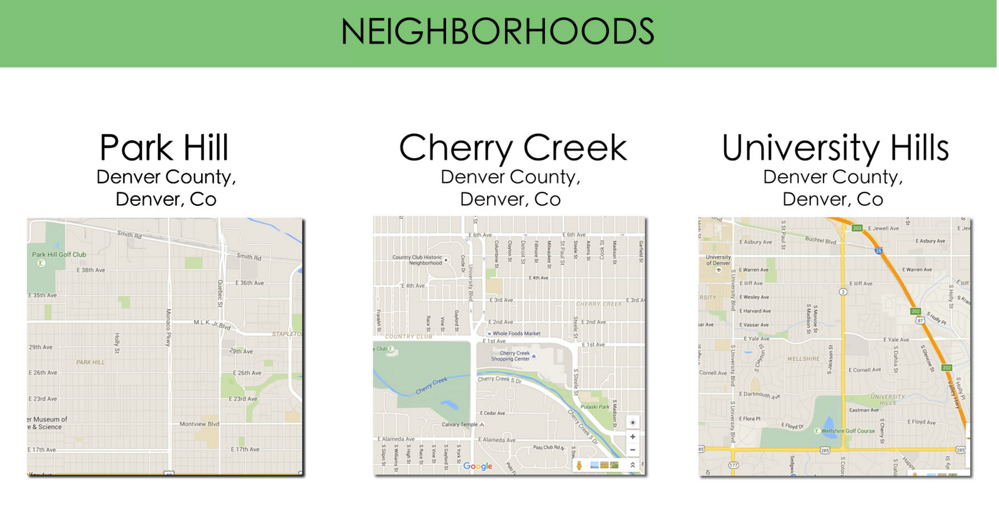

# Week Three Of Restaurants
Read through this entire document and create a DATA MODEL of your app!
Use *lucidchart* or *draw.io*

___Drop your data model here___

You will be using your skills in:
  * Validations
  * Unirest
  * Associations
  * Joins

## Adding locations

### Restaurants Updated
Keep all the fields of restaurants available and add ....
```
- Restaurants now have a full address (they should be a real address you grab from anywhere)
  - Street
  - City
  - State
  - Zip Code
- One restaurant only has one location (not dealing with chains)
- Users can now see the full address when they are on the restaurant show page
```

### Locations
```
- Users can click on a 'locations' link from the homepage
- locations homepage has a google map of all the different locations, and neighborhoods that restaurants are located in
- User can click on the neighborhood, and will be taken to the restaurant show page
```

### Restaurant show page
```
- User will now see the google map of where the restaurant is located right under the image of the restaurant

```



### Validations

```
- Users should get error messages for incorrect address format
- Users must have the correct number of characters for Zip Code field
- Street address cannot be longer than 50 characters
- None of the address inputs can be empty
```

## Stretch

1. See if you can add pins to your google maps of the exact address
2. See if you can get one main map with pins of all the restaurant locations
3. See if you can get some sort of driving direction functionality placed in there!  
