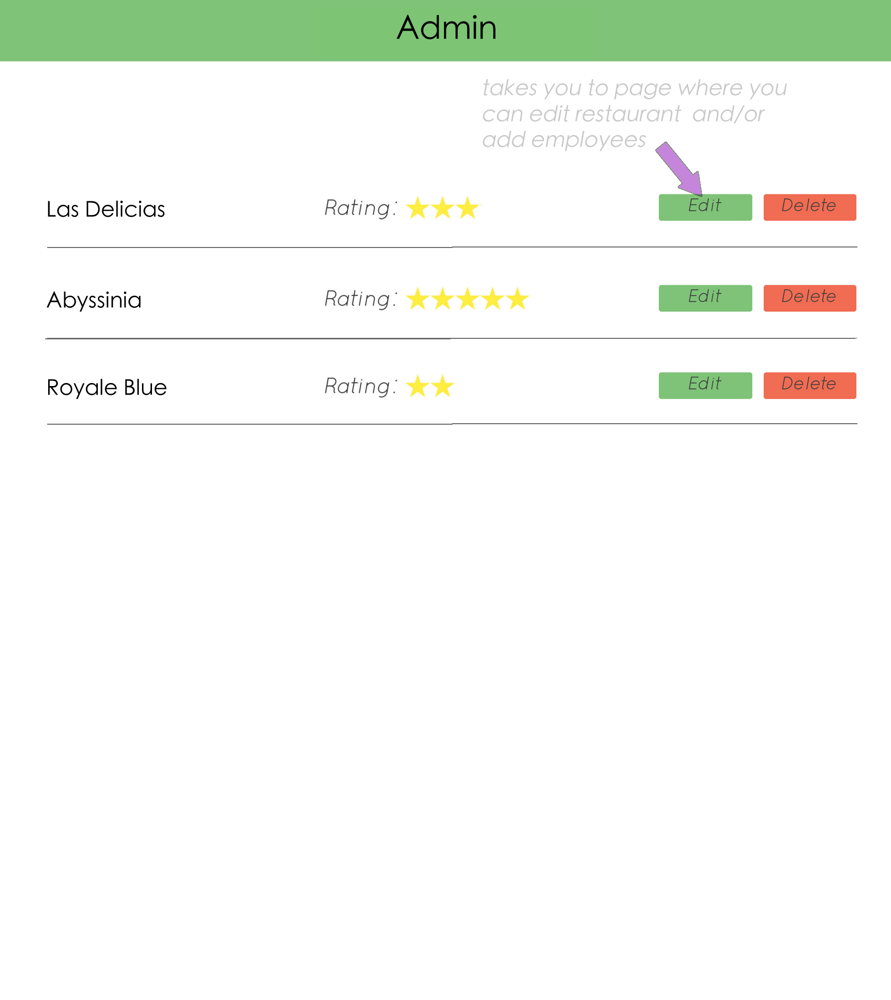

# Week Two Of Restaurants
Read through this entire document and create a DATA MODEL of your app!
Use *lucidchart* or *draw.io*

___Drop your data model here___

You will be using your skills in:
  * Joins
  * Migrations
  * Associations
  * Data Modeling
  * Validations
  * Unirest

#### User Show Page
```
- When a user comes to the restaurant show page, they will see restaurant information, restaurant reviews, and employees of the restaurant
- reviews and employees should be in 2 column format
- Users should have an option to add a new review
- Reviews should have a reviewer name, date of review, review, rating and option to edit
```
##### Stretch:
```
- The restaurant rating is calculated based on the average of the reviews
- Reviews are ordered with the most recent DATE at the top
```


### New Review

```
- When a user clicks to add a new review, they are taken to a new review page for that restaurant
- The new review should include:
  - Reviewer name
  - Review date
  - Rating
  - Review
- The user has the option to submit or cancel from this page
- When the user posts their new review, they are taken to the restaurant show page where they see all the reviews for that restaurant
```

### Show Review
```
- When a user clicks on a review, they are taken to a review show page where they can now read the full review
```
### Stretch
```
- Users can click on the '...' after a review, and the entire review populates right there where all the reviews are rather than going to a separate show page
```

### Edit Review
```
- When the user clicks 'edit' on a review, they are taken to an edit review page
- User sees all the information for the review already pre-filled
- User can cancel or submit their changes
- User has the option to delete their review  
- When the user submits their changes, they are taken to the restaurant show page where they can see all the reviews including the changes they just made
```
####Stretch:
* When a user is on the show all restaurants page (index), they can see how many reviews this restaurant has
* When a user sees the overall restaurant rating, it is an average of the ratings of all the reviews
* The reviews are shown as snippets if they are longer than the a lotted space
* The review can be expanded by clicking on the *...* of the snippet


### ADMIN Show page
```
- User has the option
```



### 2. Employees
* When a user comes to the show one restaurant page, they should be able to add employees
* Employees should have a:
  * First Name
  * Last Name
  * Position (Manager, server, host, chef)
  * restaurant association
* Employees should show up on the show one restaurant page
* The user can edit the employee information
* The user can delete a employee

####Stretch:
* The user can add multiple employees at once
* The User can delete multiple employees at once


### 3. Validations
* The user should be able to enter info about an employee and submits the form.
* The form should not be able to be submitted with blank fields.
* The user should see an error with unique styling when the form is incomplete.
* The user should see specific errors about what is missing in the form.
* The user's form data should persist when the page reloads with errors.

####Stretch
* The user should see an error when a duplicate is submitted
* The error should be specific and say "This *item* already exists!"
